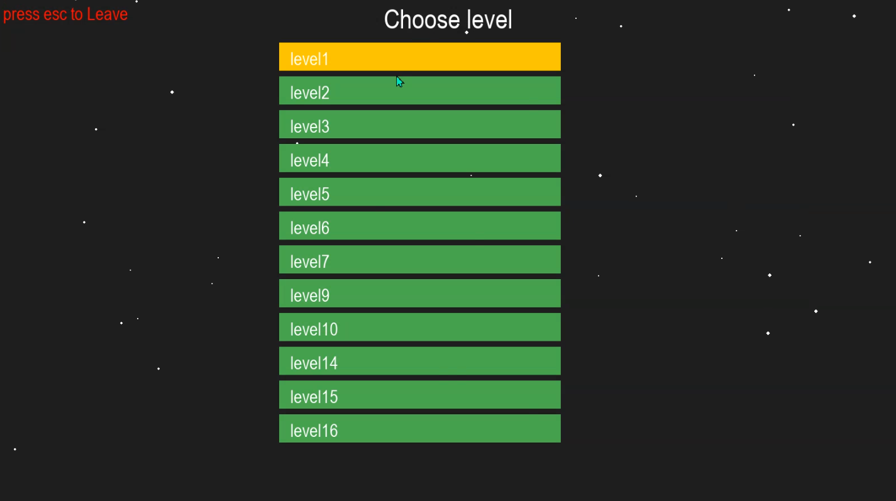
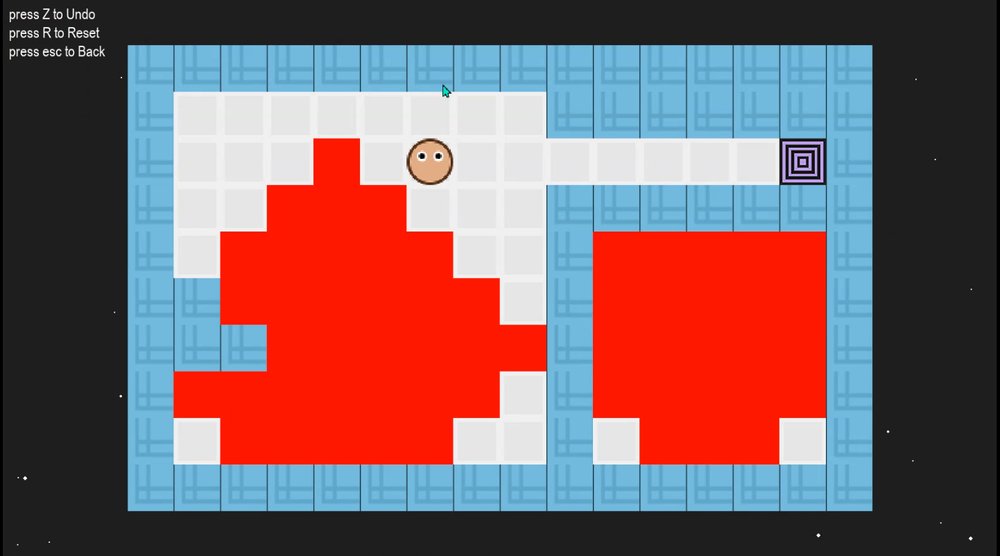
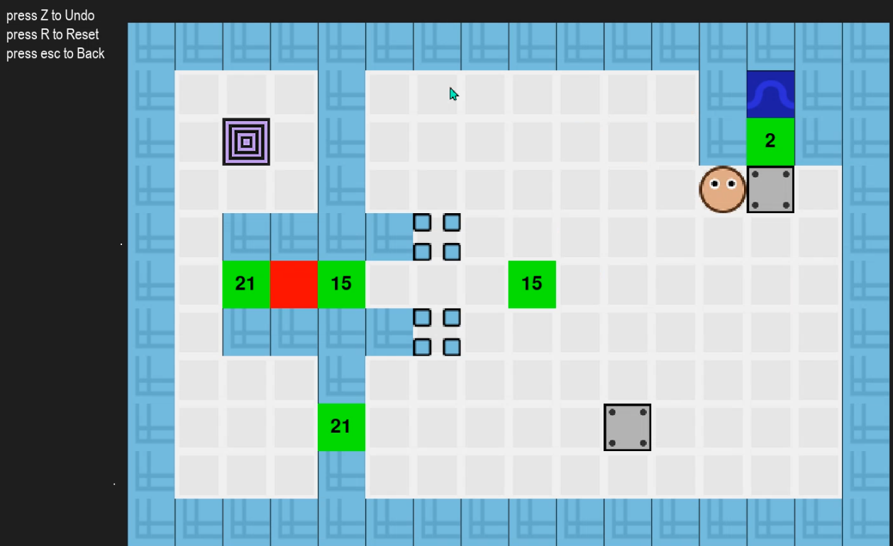
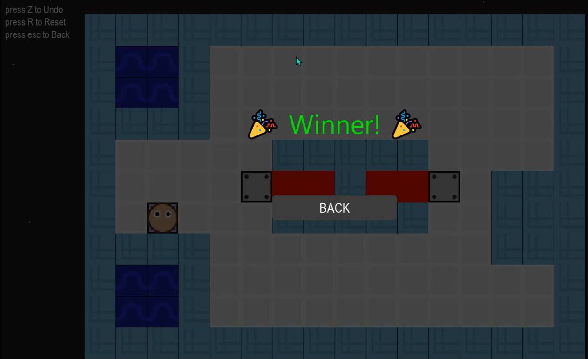

# Lava and Aqua Game

 Lava and Aqua is a puzzle game where you need to reach the exit without touching the lava on each level. The lava will flow every time you move, so think before you step. 


---

## Features

- Turn-based movement with Undo (Z) and Reset (R).
- Pushable blocks and multi-layer cell logic.
- Water and lava spread each turn with interaction rules:
  - Water + Lava = Wall.
- Numeric blocks that decrement and disappear.
- Collectible keys required to unlock the goal.
- Level loading from simple `.txt` files.
- StateManager for undo, reset, and board snapshots.
- Level selection menu with animated stars and background music.

---

## Requirements

- Python **3.10+**
- Pygame **2.x**  
Install using:
```bash
pip install pygame
```

---

## Installation

```bash
git clone https://github.com/ABDALRZAQ345/Lava_and_Aqua_Game
cd Lava_and_Aqua_Game
python -m venv .venv
pip install pygame
python main.py
```

---

## Controls

- **Arrow Keys / WASD** — Movement  
- **Z** — Undo  
- **R** — Reset  
- **ESC** — Back or Exit  
- **Enter** — Select in menus  

---

## Project Structure

```
project/
├─ main.py                 # Level selection + game launcher
├─ Game.py                 # Game loop + state handling
├─ Board.py                # Full board logic and mechanics
├─ States.py               # Undo/reset via StateManager
├─ Loader.py               # Level loader 
├─ levels/                 # Level text files
├─ Sounds/                 # Music and sound effects
├─ images/                 # Sprites and game images
├─ obj/                    # All object classes (Player, Wall, Lava, Water...)
└─ README.md
```


## Main Classes Description

### `Game` (Game.py)

Responsible for:

* Creating the `StateManager` and starting the initial state (a board instance).
* Running the main game loop (`run`) which repeatedly calls:

  * `handle_input()`
  * `update()`
  * `draw()`
* `handle_input()` processes Pygame events: Quit, undo (`Z`), reset (`R`), back (`ESC`), and movement keys forwarded to the current board (`current_board.handle_input`).
* When a movement is successful, the current board state is pushed into the `StateManager` stack (to allow undo).

---

### `StateManager` (States.py)

A  stack-based manager for storing board states.

* Provides: `push_state`, `undo`, `reset`, `get_current_state`.

---

### `Board` (Board.py)

The core logic of each level.

Contains:

* `grid`, `player`, `goal`, `keys`, `width`, `height`, `tile_size`, `GameStatus`.
* Each grid cell stores a **list of objects** (layered structure).

Key methods:

* **`handle_input(key)`**: Executes movement logic.

  * Rejects movement if outside bounds or the destination contains `Wall`, `Tube`, or `NumericBlock`.
  * Supports pushing blocks (`Block`) if the next cell is valid.
  * After movement, calls:

    * `updatelavandwater()`
    * `updateNumericBlocks()`
    * `collect_keys()`
    * `game_status()`
* **`updatelavandwater()`**: Logic for spreading water first, then lava. Handles interactions where water and lava collide (turns into walls). Avoids spreading through obstacles.
* **`updateNumericBlocks()`**: Every `NumericBlock` decrements via `decrease()` and returns itself or a ground  block when it disappear.
* **`collect_keys()`**: If the player is on a cell with a key, the key is removed, the counter decreases, and the goal is updated with remaining keys.
* **`game_status()`**: Determines win (player reaches goal with zero keys left) or loss (player touches lava or certain walls). Updates `GameStatus` and calls `player.dead()` if needed.
* **`draw(screen)`**: Renders the board to the screen.
* keys_left is the number of keys in board count it in reading file then just decrease it when player is on key 
* Additional function : `get_object_at`, `check_can_move`, `get_available_moves`.

---

## How Levels Work

- Each level is a `.txt` file inside `levels/`.
- Each character maps to an object (player, wall, water, lava, block, key…).
- Board uses a **layered grid** where cells can contain multiple objects.
- Loader converts the text layout into game objects.

---


## Screenshots







---


## License

MIT License .

